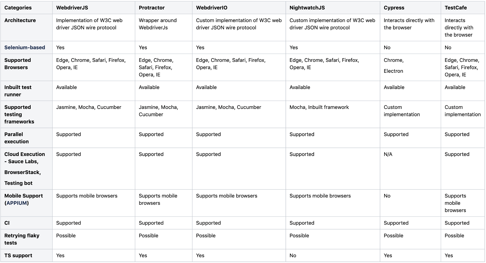

# Software Testing

Automated tests enhance software stability by catching more errors before software reaches the end user. 
They provide a safety net that allows developers to make changes without fear that they will unknowingly break something in the process.


### Unit Tests
Testing of individual units like functions or classes by supplying input and making sure the output is as expected
```
test('1 + 2 = 3', () => {
  expect(add(1, 2)).toBe(3);
})
```

### Integration Tests
Testing processes across several units to achieve their goals, including their side effects
```
describe('testing arithmetic routes', () => {
  it('GET /add => 1 + 2 = 3', async () => {
    const { body } = await request(app).get('/add?a=1&b=2');

    expect(body).toEqual({ result: 3})
  })
```

### End-to-end Tests
Testing user scenarios on the browser itself by controlling the browser programmatically.
These tests usually ignore the internals of applications and look at them like on a black box.
```
describe('Test header and title of the page', () => {
  test('Title of the page', async () => {
    const title = await page.title();
    expect(title).toBe('Calc App E2E Testing');

  }, timeout);
});
```

### Testing Structure
Refers to the organization of your tests. Nowadays, tests are usually organized in a BDD structure that supports behavior-driven development (BDD). It often looks like this:
```
describe('calculator', function() {
  // describes a module with nested "describe" functions
  describe('add', function() {
    // specify the expected behavior
    it('should add 2 numbers', function() {
       //Use assertion functions to test the expected behavior
       ...  
    })
  })
})
```

### Assertion Functions
Are used to make sure that tested variables contain the expected value. In Jest it will be `expect`

### Which Testing Framework to use?


### Resources
[supertest](https://github.com/visionmedia/supertest)
[End-to-End testing with Puppeteer and Jest](https://medium.com/touch4it/end-to-end-testing-with-puppeteer-and-jest-ec8198145321)
[js testing overview](https://medium.com/welldone-software/an-overview-of-javascript-testing-7ce7298b9870) \
[JavaScript Testing: Unit vs Functional vs Integration Tests](https://www.sitepoint.com/javascript-testing-unit-functional-integration/) \
[jest](https://jestjs.io/docs/getting-started) 


### Assignment
[fullstackopen pt.4](https://fullstackopen.com/en/part4) \
[fullstackopen pt.5](https://fullstackopen.com/en/part5)
